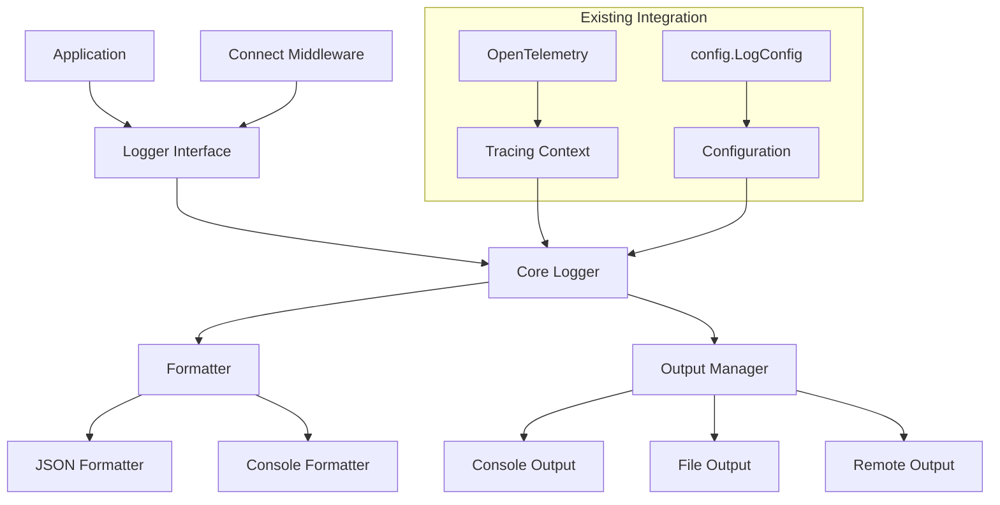

# 统一日志组件设计文档

## 概述

统一日志组件（Unified Logger）将为所有微服务提供标准化、高性能的日志记录功能。基于现有的 zap 日志库进行增强，提供分布式追踪支持、统一中间件集成和可配置的输出方式。该组件将替换和改进现有的 `internal/pkg/observability/logger.go` 实现，并统一各服务中分散的日志中间件代码。

## 指导文档一致性

### 技术标准一致性 (tech.md)
- **Go 代码规范**：遵循包命名、接口设计和错误处理标准
- **目录结构**：放置于 `internal/pkg/logger/` 目录下
- **性能标准**：满足 P95 < 50ms 的响应时间要求
- **安全标准**：实现敏感数据脱敏和安全的日志传输

### 项目结构一致性 (structure.md)
- **文件组织**：按功能模块组织文件结构
- **命名约定**：使用小写和下划线的文件命名
- **测试覆盖**：提供完整的单元测试和集成测试
- **文档标准**：提供清晰的使用文档和示例

## 代码复用分析

### 现有组件的利用
- **配置系统** (`internal/pkg/config/config.go`)：复用现有的 `LogConfig` 结构
- **基础日志实现** (`internal/pkg/observability/logger.go`)：作为基础进行扩展
- **Connect 中间件模式**：参考现有服务中的 `loggingInterceptor` 实现

### 集成点
- **配置系统**：与现有的 Viper 配置管理集成
- **Connect RPC**：为所有 Connect 服务提供统一中间件
- **分布式追踪**：与 OpenTelemetry 生态系统集成
- **监控系统**：与 Prometheus 指标收集集成

## 架构设计

### 模块化设计原则
- **核心日志器**：负责基础的日志记录功能
- **格式化器**：处理不同的输出格式（JSON、控制台）
- **输出器**：管理多种输出目标（控制台、文件、远程）
- **中间件**：提供 Connect RPC 集成
- **追踪集成**：处理分布式追踪上下文



## 组件和接口

### 核心接口设计

#### Logger 接口
```go
// Logger 定义统一的日志记录接口
type Logger interface {
    // 基础日志方法
    Debug(msg string, fields ...Field)
    Info(msg string, fields ...Field)
    Warn(msg string, fields ...Field)
    Error(msg string, fields ...Field)
    Fatal(msg string, fields ...Field)
    
    // 上下文日志方法
    DebugContext(ctx context.Context, msg string, fields ...Field)
    InfoContext(ctx context.Context, msg string, fields ...Field)
    WarnContext(ctx context.Context, msg string, fields ...Field)
    ErrorContext(ctx context.Context, msg string, fields ...Field)
    
    // 结构化日志方法
    WithFields(fields ...Field) Logger
    WithContext(ctx context.Context) Logger
    WithService(service string) Logger
    
    // 条件日志方法
    IfDebug() ConditionalLogger
    IfInfo() ConditionalLogger
    
    // 配置和管理
    SetLevel(level Level)
    Sync() error
}

// ConditionalLogger 条件日志记录接口
type ConditionalLogger interface {
    Log(msg string, fields ...Field)
    Logf(format string, args ...interface{})
}

// Field 日志字段
type Field struct {
    Key   string
    Value interface{}
}
```

#### 中间件接口
```go
// ConnectInterceptor Connect RPC 日志中间件
type ConnectInterceptor struct {
    logger Logger
    config InterceptorConfig
}

// InterceptorConfig 中间件配置
type InterceptorConfig struct {
    LogRequests    bool
    LogResponses   bool
    LogHeaders     bool
    SensitiveFields []string
    MaxBodySize    int
}
```

### 组件 1：增强的核心日志器

**目的**：扩展现有的 zap 日志器，添加分布式追踪和标准化字段支持

**接口**：
- `NewLogger(config LoggerConfig) (Logger, error)`
- `NewLoggerFromConfig(cfg *config.LogConfig) (Logger, error)`

**依赖**：
- 现有的 `internal/pkg/config` 包
- `go.uber.org/zap` 库
- `go.opentelemetry.io/otel/trace` 包

**复用**：扩展现有的 `observability.NewLogger` 功能

### 组件 2：统一 Connect 中间件

**目的**：替换各服务中重复的 `loggingInterceptor` 实现

**接口**：
- `NewConnectInterceptor(logger Logger, config InterceptorConfig) *ConnectInterceptor`
- `WithRequestLogging() InterceptorOption`
- `WithSensitiveFields(fields []string) InterceptorOption`

**依赖**：
- `connectrpc.com/connect` 库
- 核心 Logger 接口

**复用**：参考现有服务中的中间件模式

### 组件 3：分布式追踪集成器

**目的**：自动提取和传播追踪上下文信息

**接口**：
- `ExtractTraceFields(ctx context.Context) []Field`
- `WithTraceContext(ctx context.Context, logger Logger) Logger`

**依赖**：
- `go.opentelemetry.io/otel` 包
- `context` 标准库

**复用**：与现有的 OpenTelemetry 集成（如果存在）

### 组件 4：可配置格式化器

**目的**：支持多种输出格式，满足不同环境需求

**接口**：
- `NewJSONFormatter(config JSONConfig) Formatter`
- `NewConsoleFormatter(config ConsoleConfig) Formatter`

**依赖**：
- `encoding/json` 标准库
- `go.uber.org/zap/zapcore` 包

**复用**：扩展现有的格式配置逻辑

## 数据模型

### LoggerConfig 扩展
```go
type LoggerConfig struct {
    // 基础配置 - 复用现有的 config.LogConfig
    Level  string `mapstructure:"level"`
    Format string `mapstructure:"format"`
    
    // 新增配置
    Output      OutputConfig      `mapstructure:"output"`
    Tracing     TracingConfig     `mapstructure:"tracing"`
    Middleware  MiddlewareConfig  `mapstructure:"middleware"`
    Performance PerformanceConfig `mapstructure:"performance"`
}

type OutputConfig struct {
    Console ConsoleConfig `mapstructure:"console"`
    File    FileConfig    `mapstructure:"file"`
    Remote  RemoteConfig  `mapstructure:"remote"`
}

type TracingConfig struct {
    Enabled     bool     `mapstructure:"enabled"`
    ServiceName string   `mapstructure:"service_name"`
    Version     string   `mapstructure:"version"`
    Environment string   `mapstructure:"environment"`
}

type MiddlewareConfig struct {
    LogRequests     bool     `mapstructure:"log_requests"`
    LogResponses    bool     `mapstructure:"log_responses"`
    LogHeaders      bool     `mapstructure:"log_headers"`
    SensitiveFields []string `mapstructure:"sensitive_fields"`
    MaxBodySize     int      `mapstructure:"max_body_size"`
}

type PerformanceConfig struct {
    AsyncWrite    bool `mapstructure:"async_write"`
    BufferSize    int  `mapstructure:"buffer_size"`
    FlushInterval int  `mapstructure:"flush_interval_ms"`
}
```

### 标准化日志字段
```go
type StandardFields struct {
    // 基础字段
    Timestamp time.Time `json:"timestamp"`
    Level     string    `json:"level"`
    Message   string    `json:"message"`
    Service   string    `json:"service"`
    Version   string    `json:"version"`
    
    // 追踪字段
    TraceID string `json:"trace_id,omitempty"`
    SpanID  string `json:"span_id,omitempty"`
    
    // 请求字段
    RequestID  string        `json:"request_id,omitempty"`
    UserID     string        `json:"user_id,omitempty"`
    Method     string        `json:"method,omitempty"`
    Path       string        `json:"path,omitempty"`
    Duration   time.Duration `json:"duration_ms,omitempty"`
    StatusCode int           `json:"status_code,omitempty"`
    
    // 错误字段
    Error      string `json:"error,omitempty"`
    StackTrace string `json:"stack_trace,omitempty"`
    ErrorCode  string `json:"error_code,omitempty"`
    
    // 自定义字段
    Fields map[string]interface{} `json:"fields,omitempty"`
}
```

## 错误处理

### 错误场景和处理策略

#### 场景 1：日志系统初始化失败
- **处理**：回退到标准库 `log` 包，记录初始化错误
- **用户影响**：服务仍可正常启动，但日志功能受限

#### 场景 2：输出目标不可用（文件权限、网络问题）
- **处理**：自动回退到控制台输出，记录错误信息
- **用户影响**：日志仍可记录，但输出目标改变

#### 场景 3：日志缓冲区溢出
- **处理**：丢弃最旧的日志条目，保持系统稳定
- **用户影响**：可能丢失部分历史日志，但不阻塞业务

#### 场景 4：分布式追踪上下文提取失败
- **处理**：继续正常日志记录，但不包含追踪信息
- **用户影响**：日志仍可记录，但缺少追踪关联

#### 场景 5：敏感数据脱敏失败
- **处理**：完全隐藏相关字段内容，记录脱敏错误
- **用户影响**：部分字段显示为 `[REDACTED]`，但不泄露敏感信息

## 测试策略

### 单元测试

#### 核心日志器测试
- **日志级别过滤功能**：测试不同级别的日志记录和过滤
- **字段序列化**：测试结构化字段的正确序列化
- **错误处理**：测试各种错误场景的处理逻辑
- **配置加载**：测试从不同配置源加载配置

#### 中间件测试
- **请求日志记录**：测试 RPC 请求的自动日志记录
- **错误响应处理**：测试错误响应的详细日志记录
- **敏感数据脱敏**：测试敏感字段的正确脱敏
- **性能影响**：测试中间件对请求性能的影响

#### 格式化器测试
- **JSON 格式**：测试 JSON 输出的结构和内容正确性
- **控制台格式**：测试人类可读格式的输出
- **字段转换**：测试不同数据类型的字段转换
- **错误格式化**：测试错误信息的格式化

### 集成测试

#### 完整日志流程测试
- **端到端日志记录**：从 API 请求到日志输出的完整流程
- **多服务追踪**：测试跨服务的追踪上下文传播
- **配置热重载**：测试运行时配置更新的效果
- **并发安全**：测试高并发情况下的日志记录

#### 外部系统集成测试
- **文件输出**：测试日志文件的创建、轮转和权限
- **远程日志系统**：测试与 ELK、Grafana Loki 等的集成
- **监控指标**：测试日志组件自身的监控指标
- **OpenTelemetry 集成**：测试与追踪系统的集成

### 端到端测试

#### 用户场景测试
- **开发环境使用**：测试开发者的典型使用场景
- **生产环境配置**：测试生产环境的配置和性能
- **故障恢复**：测试系统故障后的自动恢复
- **扩展性验证**：测试组件的扩展性和定制能力

## 实现计划

### 阶段 1：核心功能实现
1. 扩展现有的 `logger.go`，添加新的接口和功能
2. 实现标准化字段和格式化器
3. 添加基础的配置支持

### 阶段 2：中间件集成
1. 实现统一的 Connect 中间件
2. 替换各服务中的重复代码
3. 添加敏感数据脱敏功能

### 阶段 3：分布式追踪
1. 集成 OpenTelemetry 支持
2. 实现追踪上下文的提取和传播
3. 添加追踪相关的配置选项

### 阶段 4：性能优化
1. 实现异步写入和缓冲机制
2. 添加性能监控和指标
3. 优化内存和 CPU 使用

### 阶段 5：测试和文档
1. 完善单元测试和集成测试
2. 编写详细的使用文档和示例
3. 性能基准测试和优化